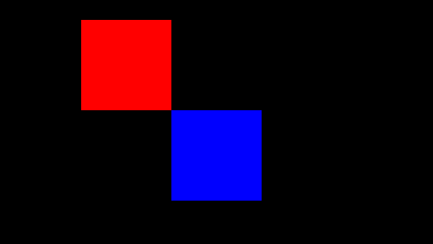
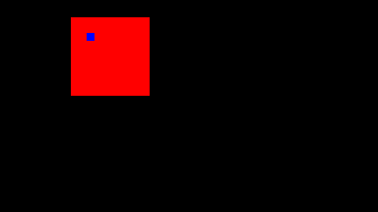
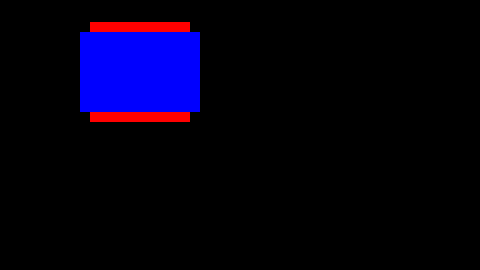

# Testauksen dokumentaatio

## Projektissani testattavia metodeja on paljon. Keskeisimmät näistä algoritmien toiminnan kannalta ovat kuitenkin:  
    1. Triangle luokan toimivuus
    2. BowyerWatson luokan toimivuus

## Muita testattavia metodeja ovat:  
    1. Rectangle luokka
    2. roomGeneration, eli huoneiden generoinnista huolehtiva moduuli.
    3. listMatrix.py, eli moduuli, joka luo matriisin ennalta annettujen tietojen pohjalta.
    4. kruskal.py, eli minimal spanning treen luova moduuli.
    5. a_star.py, joka sisältää kaikki vaadittavat funktiot lyhimpien reittien luomiseen  
    ja niiden pohjalta matriisin generoimiseen.

## Moduulit, joiden testaus on valmiina:  
    1. Triangle luokka  
        Triangle luokan testit koostuvat lähinnä trigonometristen laskujen oikeellisuuden testaamisesta.  
        Testeihin kuuluu bowyer-watson algoritmille tärkeiden tietojen tarkastus. Näitä ovat:  
            - Kolmion reunojen oikea asetus
            - Kolmion ympärysympyrän keskuspisteen sijainnin laskeminen
            - Kolmion sivujen pituuksien oikea laskeminen
            - Kolmion kulmien koon oikea laskeminen
            - Kolmion ympärysympyrän äteen pituuden oikea laskeminen
            - Uuden pisteen sijainnin tarkistus suhteessa kolmion ympärysympyrään:  
                onko piste ympärysympyrän sisällä vai ei.  
    
    2. Rectangle luokka
        Rectangle luokan testit keskittyvät pääsääntöisesti luokasta luotavien  
        suorakulmioiden päällekkäisyyksien tarkastamiseen.
        Testeissä käyään läpi erilaiset tilanteet, joissa suorakulmiot ovat päällekkäin.  
        Tälläisiä tilanteita ovat osittainen päällekkäisyys,  

            
        
        Kokonainen päällekkäisyys,  
        
            
        
        Ja toisen suorakulmion läpäiseminen.
        
            
